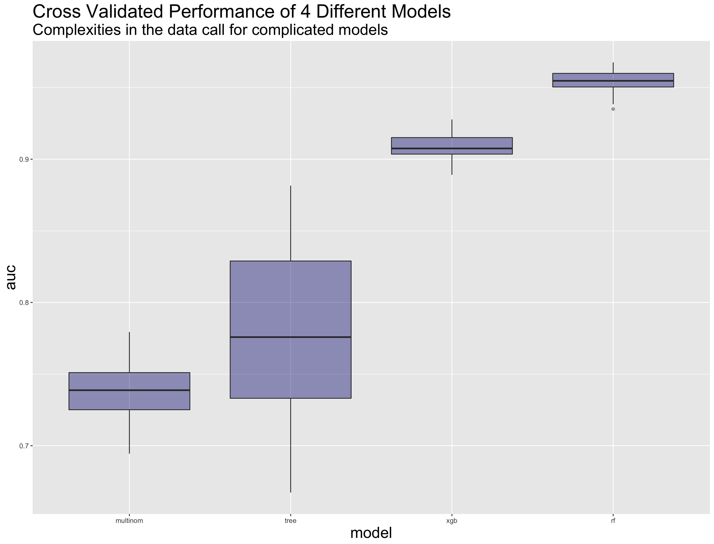

```{r setup, include=FALSE, message = F}
knitr::opts_chunk$set(echo = TRUE)
```

The goals today are twofold. In line with the Kaggle instructions, I will first 
try to predict the poverty status variable (`Target`) as best as possible. But 
perhaps more importantly, I will try to understand exactly what explains poverty 
in this dataset by reducing and simplifying a model into a coherent form. 
Exploratory analysis involves not only understanding data, but also 
understanding the models that one prescribes to the data.

## Setup

Load some of my favorite packages, read some csv's. 
```{r, message = F}
library(tidyverse)
library(rpart)
library(rpart.plot)
library(nnet)
library(randomForest)
library(xgboost)
library(caret)
library(pROC)

costa_rica <- read_csv("data/train.csv")
data_dict  <- read_csv("data/data-dict.csv")
```

## Basic EDA

This is a fairly wide dataset (dimensions: `r nrow(costa_rica)` x `r ncol(costa_rica)`), 
which makes it difficult and time consuming to manually understand each feature. For 
now, I will check for `NA`'s and other oddities. [rOpenSsci's][1] `visdat` 
package makes this easy. The plot below is essentially a picture of the 
dataset at a 10,000 foot view.

```{r, message = F, out.width = '90%'}
visdat::vis_dat(costa_rica %>% sample_frac(.01))
```

A couple of columns have a lot of `NA`'s. It's also nice to see the distribution 
of column types (mostly integers, a few doubles and a few characters). This is a 
good sanity check because the data dictionary suggests that many of the 
columns are countable measures.

But the plot above makes it hard to read the column names. 
What exactly is in here? Below is a glimpse of the data dictionary.

```{r, echo = F}
head(data_dict, 10)
```

Pretty interesting stuff. There are a handful of features pertaining to things 
like education, housing quality, and access to technology. The column names are 
in Spanish, so I will be referring back to the data dictionary often. Each row 
in the dataset represents a person, so the `Target` column is that person's 
income status. The Kaggle problem, however, wants a prediction for each 
household (`idhogar`), so I will have to do a little transformation.

And what about the `Target` variable? Kaggle notes that there are four income levels.

  * 1: Extreme Poverty  
  * 2: Moderate Poverty 
  * 3: Vulnerable Households 
  * 4: Non Vulnerable Households 

```{r, out.width = '90%'}
ggplot(costa_rica, aes(x = Target)) + 
  geom_bar(fill = "navy", alpha = .8) + 
  ggtitle("Target Counts", 
          subtitle = "Non Vulnerable Households by far the most common")
```

Because there are four levels, I will need to approach this as a 
[multinomial classification][2] problem, 
which is unfortunately harder to interpret than binary classification or regression. 
It's also worth noting that the `Target` variable is skewed, with the count of 
level **4**'s dwarfing the others. This is thankfully a good thing for the people of Costa Rica, 
but it might make the analysis again more difficult. In machine learning jargon this is known 
as an imbalanced dataset. There are ways to ameliorate this issue, but I might not need 
to examine them just yet.

## Data Prep

```{r, message = F}
# re-assign Targets to appropriate head of household Targets ----
parent_targets <- 
  costa_rica %>% 
  filter(parentesco1 == 1) %>%
  dplyr::select(idhogar, hh_Target = Target)

costa_rica_adj <- 
  costa_rica %>% 
  left_join(parent_targets) %>% 
  mutate(
    Target = if_else(is.na(hh_Target), Target, hh_Target)
  )

# remove the annoying variables for now ----
no_nas <- function(x) {
  !any(is.na(x))
}

costa_rica_adj<-
  costa_rica_adj %>% 
  dplyr::select(-Id, -idhogar, -hh_Target) %>%
  dplyr::select_if(is.numeric) %>%  
  dplyr::select_if(no_nas) %>% 
  dplyr::select_if(.predicate = funs(sd(.) > 0))
```

The Kaggle instructions call for one prediction per household. So I converted every non 
head of household's `Target` level to its corresponding parent `Target` (`parentesco1 == 1`). 
For simplicity, I also decided to ignore any column with an `NA` and any non-numeric 
column. This reduced the dataset's dimensions to `r nrow(costa_rica_adj)` x `r ncol(costa_rica_adj)`.


## Machine Learning Models: First Pass

For a classification problem like this with many reasonable features 
(and for which I have little domain knowledge), I like to throw a random forest at it and 
see what sticks. 
[This post][3] on 
Medium gives a good background of why this is a fair choice. Not to 
mention [this paper][4] referenced in the 
article (and written by very smart people at Cornell). 

```{r, message = F}
# split up train and test ----
train_rows <- sample(x = 1:nrow(costa_rica_adj), size = 0.8 * nrow(costa_rica_adj))

train <- 
  costa_rica_adj %>% 
  filter(
    row_number() %in% train_rows
  )

test <-
  costa_rica_adj %>% 
  filter(
    !(row_number() %in% train_rows)
  )

set.seed(1)
rfmod <- randomForest(factor(Target) ~ ., data = train, ntree = 50, importance = T)
```

After splitting the cleaned up dataset into `train` and `test` data frames, I built a 
random forest with 50 trees. The plot below, however, suggests I might not even need that many.

```{r, out.width = '90%'}
plot(rfmod)
```

Each of the lines above represent the relationship between accuracy and the number 
of trees. The dashed and dotted ones represent each of the `Target` levels 
(red = **1**, green = **2**, blue = **3**, light blue = **4**), while the black line 
represents the overall model accuracy. I've also got the output of the confusion matrix below.

```{r, message = F}
rfpreds <- predict(rfmod, newdata = test) %>% as.character() %>% as.numeric()

cm <- caret::confusionMatrix(table(rfpreds, actual = test$Target))

cm$table %>% ftable() %>% pander::pander()

cm$byClass %>% data.frame() %>% dplyr::select(Sensitivity, Specificity) %>% t() %>% knitr::kable()
```

A couple of points to emphasize here. 

* There is a lot of discrepancy between the errors for each level. For `Target = 3`, 
the sensitivity (true positive) is around 30%, whereas for `Target = 4`, it is around 1%. 
The confusion matrix also suggests that the difference between `Target = 3` and `Target = 4` 
is pretty subtle, as most of the misclassifications of **3** were put in the **4** bucket.

* The benefit of adding trees diminishes quickly. The errors for `ntree = 15` versus 
`ntree = 50` are within a percentage point or two. With this in mind, it seems that 
the only way to do much better for this problem by
    * exploring other models or
    * engineering new features
    
    I'll explore the first of these in the next section.

## Machine Learning Validation

This is the [bike shed][5] portion of 
the report. But I will say, the final graph is a big argument for ensemble methods and/or boosting.

How do other models perform on this data? I decided to explore a few others 
that natively support multinomial classification in R. 

* Decision Trees from the `rpart` package

* Multinomial Regression from the `nnet` package

* Random Forests from the `randomForest` package

* eXtreme Gradient Boosted Trees from the `xgboost` package

The first two could be called "interpretable", while the next two are pretty much 
black boxes. Comparing these models lets me quantify the tradeoffs of interpretability 
and predictive performance, which falls nicely in line with my other main goal today. 

Below is the output of a 30-fold cross validation for each of the models above. Each time, 
I measured the [AUC][6] by comparing the individual fold's predictions to the individual 
fold's holdout set. The AUC has a slightly different interpretation [in the multiclass scenario][7], 
but this is a fact I will gloss over for now. If you are interested in the simulation code, 
it is [here][8].

```{r, out.width = '90%'}

```

In short, we see that the random forests take the cake. And the average difference 
between the two baseline models and the two complicated models is somewhere in the 
realm of .15 AUC points. Which is quite a lot, considering that the practical domain 
of AUC's is between .5 and 1.0. By using a simpler model, I would be potentially 
sacrificing a lot of classification effectiveness.  

## Variable Importance, Model Simplification

This is not to say that there is no hope of understanding what the models are 
doing. Both `randomForest` and `xgboost` have built in methods to assess variable 
importance (which in my humble opinion is one of the most important areas of 
machine learning right now). Because both algorithms involve many iterations / samples, 
they are able to store the average marginal impact a specific column has on 
classification accuracy. This results in a big-picture ranking of 
columns from "most important" to "least important". 

The plot below is the ranking done by the original `randomForest` model.

```{r}
varImpPlot(rfmod, type = 1, pch = 20, col = "navy", cex = .9)
```

The most important predictors require a consultation with the data dictionary. Here are the top 10.

```{r, message = F}
top10_cols <- 
  importance(rfmod) %>% 
  data.frame() %>% 
  rownames_to_column(var = "col_name") %>% 
  arrange(desc(MeanDecreaseAccuracy)) %>% 
  head(10)

top10_cols %>% 
  inner_join(data_dict) %>% 
  dplyr::select(col_name, description) %>% 
  knitr::kable()
```

The `r4**` columns all have to do with age distribution and dependency statuses 
of the family. `coopele`, `qmobilephone` involve access to electricity. And we've got 
a few that are associated with household amenities (`sanitario*`, `energicocinar*`). 
Most of these make sense. What does the `xgboost` model suggest? A side note, the 
code for this wasn't as easy as the `randomForest` above. 

```{r, message = F}
xgb_params <- list("objective" = "multi:softprob",
                   "eval_metric" = "mlogloss",
                   "num_class" = 4)

xgbmod <- 
  xgboost(
    xgb.DMatrix(
      as.matrix(train %>% dplyr::select(-Target)),
      label = (train %>% pull(Target) -1 )
    ), 
    nrounds = 20, verbose = 0, 
    params = xgb_params)
  
xgb_top10_cols <- 
  xgb.importance(
    feature_names = colnames(train %>% dplyr::select(-Target)), 
    model = xgbmod) %>% 
    head(10)

ggplot(xgb_top10_cols,
       aes(x = reorder(Feature, Gain), y = Gain)) + 
  geom_col(fill = "navy", alpha = .8) + 
  xlab("Feature") +
  coord_flip() + 
  ggtitle("xgboost feature importance", 
          subtitle = "Many of the same as random forest")
```

Again we see similar results, although not exactly the same column names. 
Could this be because several of the columns are related to each other?

Here's a thought. What if we take the top 30 features from both models, 
find the intersection between them, and then build a final model off 
of that? How much worse will it perform than the original random forest? 
The table below are the features that are ranked in the top 30 of both models.

```{r}
overlapping_vars <- 
  importance(rfmod) %>% 
  data.frame() %>% 
  rownames_to_column(var = "col_name") %>% 
  arrange(desc(MeanDecreaseAccuracy)) %>% 
  head(30) %>% 
inner_join(
  xgb.importance(
    feature_names = colnames(train %>% dplyr::select(-Target)), 
    model = xgbmod) %>% 
    head(30),
  by = c("col_name" = "Feature")
)

overlapping_vars %>% knitr::kable()
```

There are `r nrow(overlapping_vars)` of them. 
Now train an updated random forest with 
`r nrow(overlapping_vars)` / `r ncol(train) - 1` = `r round(nrow(overlapping_vars) / (ncol(train) - 1), 2) * 100`% 
of its original features.

```{r}
rfmod_simple <- randomForest(factor(Target) ~ ., data = train %>% dplyr::select(overlapping_vars$col_name, Target), ntree = 50)

rfpreds_simple <- predict(rfmod_simple, newdata = test) %>% as.character() %>% as.numeric()

cm2 <- caret::confusionMatrix(table(rfpreds_simple, actual = test$Target))

cm2$table %>% ftable() %>% pander::pander()

cm2$byClass %>% data.frame() %>% dplyr::select(Sensitivity, Specificity) %>% t() %>% knitr::kable()
```

For comparison, here's the results against the original 

```{r}
cm$table %>% ftable() %>% pander::pander()

cm$byClass %>% data.frame() %>% dplyr::select(Sensitivity, Specificity) %>% t() %>% knitr::kable()

```

And if you're curious about AUC's, the original random Forest with 50 trees had 
an AUC of `r pROC::multiclass.roc(rfpreds, test$Target)$auc` and the reduced model 
has an AUC of `r pROC::multiclass.roc(rfpreds_simple, test$Target)$auc` against the same test set.
Pretty nice. Interpretable dimensionality reduction (a hack) with no PCA.


## Conclusions and Next Steps

Poverty in this dataset is primarily described by 

  a) the number of working-age people
  b) the access to electricity
  c) the average educational level
  
of the member's household. Although this result is not exactly surprising,
I think it's important to verify the output of the models with intuition when possible,
especially considering the importance of the issue here.

The most interesting avenue for further research into this dataset, in my opinion,
is to investigate the difficult-to-classify cases and see if there are 
commonalities among them. If this could be determined from within the data, 
one could engineer clever new features to help train models. Other than that, 
I would like to learn more about the culture and political 
background of Costa Rica, along with the critical issues experts in the
region deem important to reducing poverty. 

I've had a lot of fun working on this problem and would like to thank the 
Kaggle community for putting time and energy into questions like these.

[1]: https://ropensci.org/
[2]: https://en.wikipedia.org/wiki/Multiclass_classification
[3]: https://medium.com/rants-on-machine-learning/the-unreasonable-effectiveness-of-random-forests-f33c3ce28883
[4]: http://lowrank.net/nikos/pubs/empirical.pdf
[5]: https://en.wikipedia.org/wiki/Law_of_triviality
[6]: https://en.wikipedia.org/wiki/Receiver_operating_characteristic#Area_under_the_curve
[7]: https://stats.stackexchange.com/questions/2151/how-to-plot-roc-curves-in-multiclass-classification
[8]: 02-cv-models.R